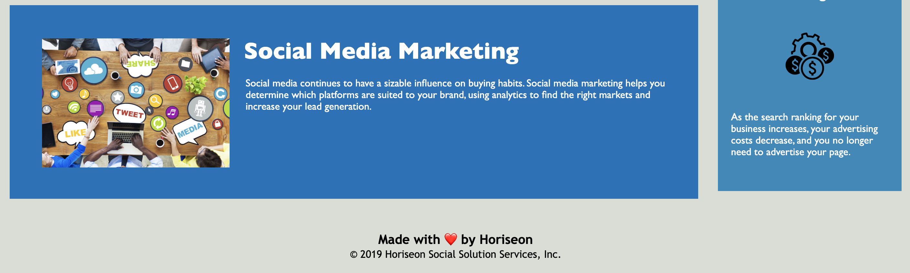

# HTML CSS Git Challenge: Code Refactor

## About the Repository

This client is a marketing agency, Horiseon, that wants its codebase to meet accessibility standards for search engine optimization. 

## Client Acceptance Criteria

* Semantic HTML elements 
* Elements that follow a logical structure, independent of styling and positioning
* Images made accessible through alt attributes
* Heading attributes that are in sequential order
* A title that is concise and descriptive

## Additional instruction to complete the final challenge included:

* All navigation links are functioning correctly
* CSS selectors and properties are consolidated and organized to follow a semantic structure
* CSS file has comments 
* Application deploys at live URL with no loading errors 
* Application looks at least 90% similar to the solution
* Repository as a unique name, has proper file structure, contains multiple descriptive commit messages, and a quality README file with description, screenshot of the final project, and a link to the live deployed application

## Describe the steps that were taken in your HTML file to make your webpage more accessible:

There were multiple steps taken to make this webpage more accessible for my clients' audience. Starting from the title of the webpage (which appears as the tab description in your browser), this was renamed to "Horiseon Home Page" to describe what the viewer would be looking at when they clicked on the URL for this webpage. 

Next, in the website's header, the "seo" span element within the Horiseon now appears more visible to the viewer after changing the color to contrast more with the background. 

After that, the proper id was added to the "search engine optimization" link so that when the user clicks on the button, it will bring them to the correct content section for that link. 

Finally, all of the pictures displayed in the main section, as well as the aside column of the webpage, have alt attributes that adequately describe what the image is showing in case of page breaks and for accessibility purposes. 

## This is what my final Horiseon webpage looks like:

